# Project: AWS-datalake-pipeline

This project simulates the creation of a `Data Lake` using Amazon S3. It follows a layered architecture with both `raw and processed layers`. The pipeline includes automated data cleaning, conversion from the original CSV format to `Parquet`, and the automated creation of an external table in `AWS Athena` for running SQL queries and building interactive dashboards in `Amazon QuickSight`.

## Tools & Setup

This project uses the following stack:

- `Amazon S3` - cloud storage used to host both raw and processed data layers.
- `AWS Athena` - serverless query service to run SQL on data stored in S3.
- `Amazon QuickSight` - BI tool for building dashboards directly from Athena queries.
- `Python (Pandas, Boto3, PyArrow)` - core scripting tools for data cleaning and transformation, file format conversion (CSV → Parquet), uploading files to S3

### Install Dependencies

```bash
pip install pandas boto3 python-dotenv kaggle pyarrow
```

## Pipeline Overview

This section describes the full lifecycle of data flow starting from the raw S3 layer through processing and analytics to visualization.

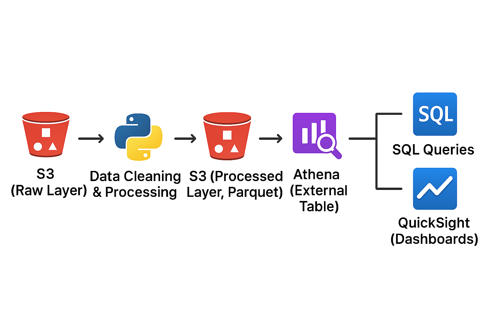 

1. **Setting Up the S3 Bucket**

Before starting the data pipeline, an Amazon S3 bucket is manually created to store all layers of the data lake.

2. **Creating the Raw Layer**

The pipeline begins with a real-world dataset from Kaggle:  
[New York City Airbnb Open Data](https://www.kaggle.com/datasets/dgomonov/new-york-city-airbnb-open-data)
This dataset contains 16 basic columns describing Airbnb Booking.

Using the script [st1_ny_download_and_upload.py](NY_airbnb/st1_ny_download_and_upload.py), the dataset is downloaded from Kaggle and uploaded to the raw/ folder in the S3 bucket without any modifications.

3. **Data Cleaning**

Before implementing transformations, the raw dataset was explored in Jupyter Notebook — data types were inspected, inconsistencies identified, and cleaning rules defined.

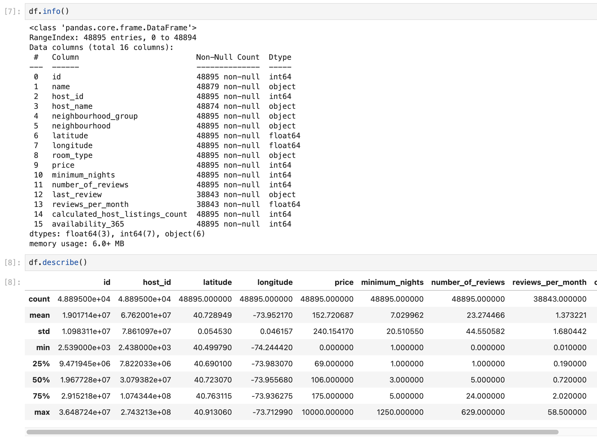
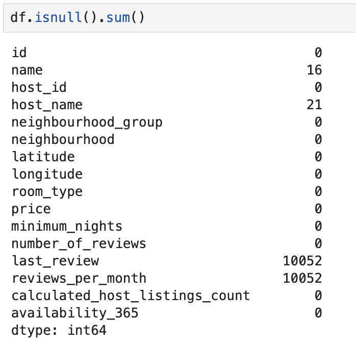

Then, using a Python script, the pipeline:
- Removed duplicate rows;
- Dropped records with missing or invalid date values;
- Filtered out extreme values in `price`;

4. **Data Conversion & Processed Layer Upload**

The cleaned dataset was saved in `Parquet` format and uploaded to the processed/ folder in S3.

5. **Automated Athena Schema Generation and Table Creation**

To make the processed data queryable in Amazon Athena, this step automatically creates an external table based on the Parquet schema.

Using helper functions from `generate_athena_schema_func.py` :

- Column data types are mapped to Athena-compatible types as follows:

```
String columns (type object in pandas) are mapped to string in Athena.
Integer columns (int64, int32) are mapped to int.
Floating-point columns (float64, float32) are mapped to double.
Boolean columns (bool) are mapped to boolean.
Datetime columns (datetime64[ns]) are mapped to timestamp (format: YYYY-MM-DD HH:MM:SS).
```

- A CREATE EXTERNAL TABLE statement is dynamically generated based on the processed dataset.

- The SQL query is then executed using the Boto3 Athena client, registering the external table that points to the processed Parquet files stored in S3.

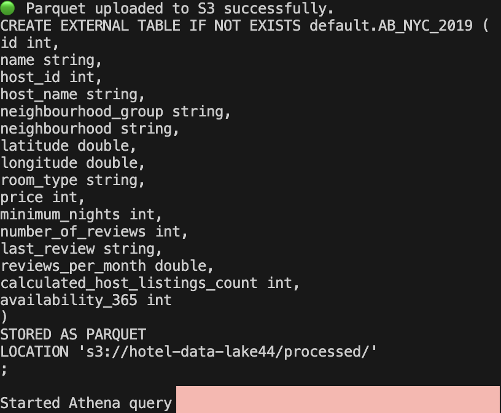

`Steps 3–5 are handled in a single script: st2_ny_raw_to_parquet.py`

6. **SQL Analysis in Athena**

Once the external table is registered, we use `Amazon Athena` to run SQL queries directly on the Parquet data stored in S3.

Examples of analytical queries:

`Top 10 Airbnb hosts` by number of listings:
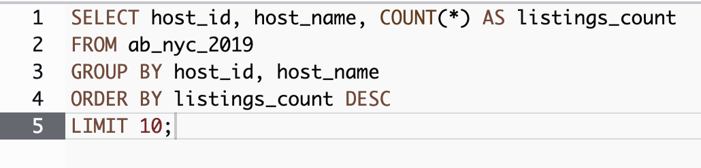
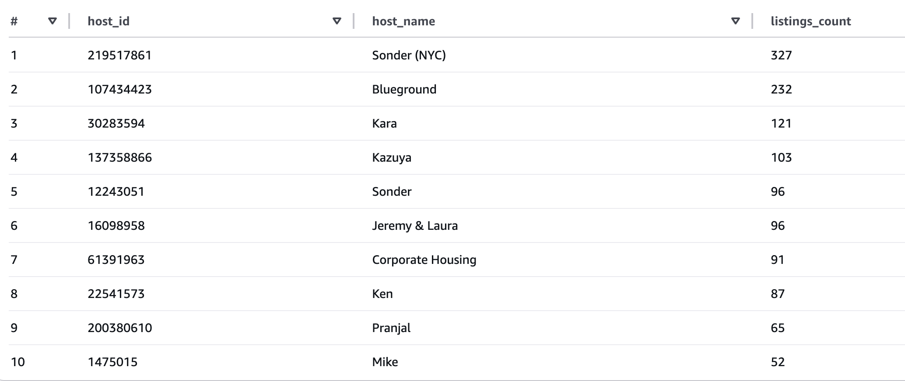

`Share of listing types by neighbourhood group`:
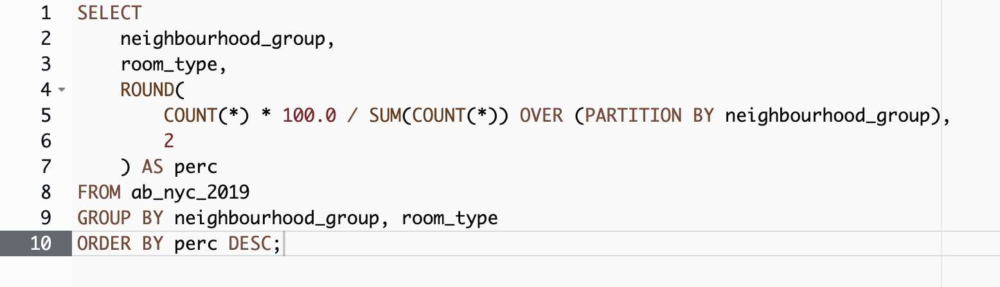
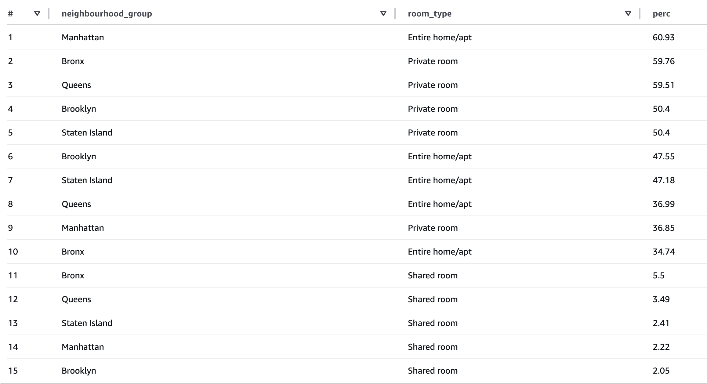

7. **Data Visualization in Amazon QuickSight**

The final stage involves creating `interactive dashboards` using `Amazon QuickSight`.
After the table is created in Athena and the data schema is defined, we connect QuickSight to the Athena table as a data source. From there, we build visualizations to explore trends and patterns in the dataset.

Examples:
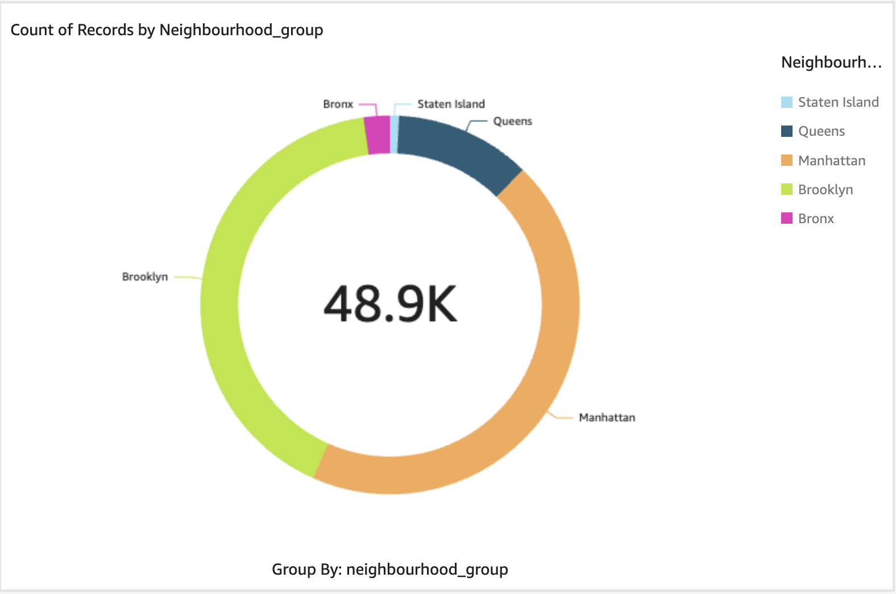
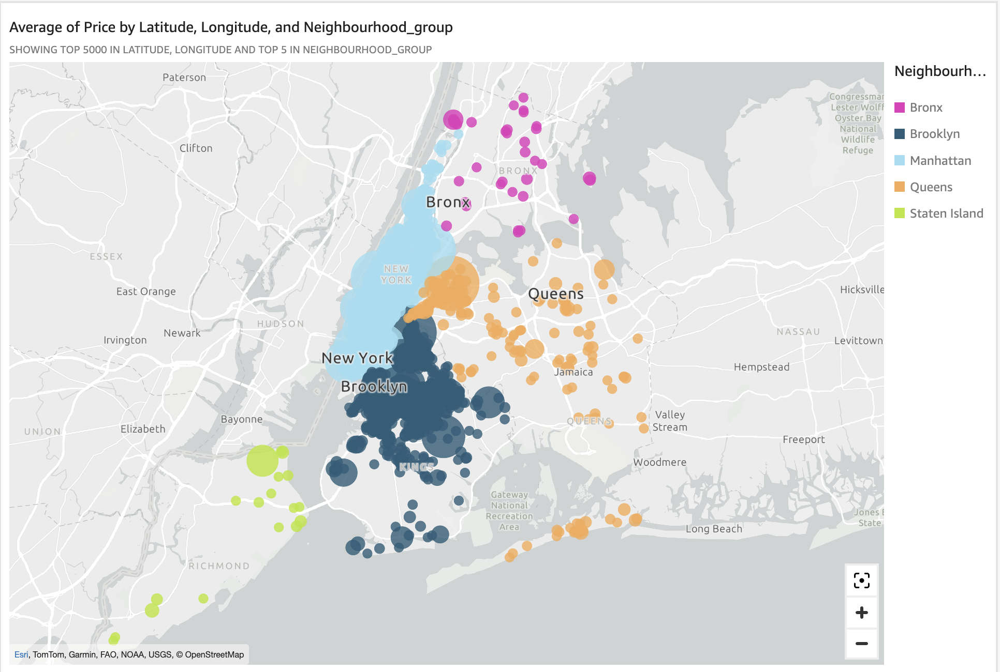
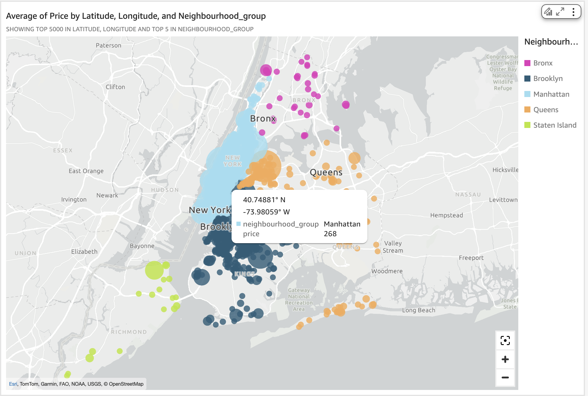

## Summary

This project simulates the full lifecycle of `Data Lake` on AWS — from raw data ingestion to analytics-ready datasets and visual dashboards.

We started with raw CSV data from `Kaggle` and went through the following key stages:

- Data ingestion into `S3` (raw/ layer)

- Automated cleaning and transformation with Pandas

- Conversion to Parquet format and storage in the `processed/ layer`

- Schema generation and table creation in `AWS Athena`

- SQL querying and interactive visualization via `Amazon QuickSight`

**S3 Bucket Structure**

At the end of the pipeline, the S3 bucket contains the following structure:
- `raw/` — Contains the original CSV file uploaded from Kaggle

- `processed/` — Stores the cleaned and optimized dataset in Parquet format

- `athena-results/` — Includes a .txt file with the generated SQL statement used to create the Athena external table

- `athena-query-results/` — Stores CSV files with the output of executed Athena queries

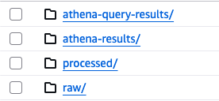

## Learning Notes

This project was my first hands-on experience with AWS services from working with S3 to querying with Athena and visualizing data in QuickSight.

You can notice in the project structure that I worked with two datasets:
- My first dataset was [Hotel Booking dataset](https://www.kaggle.com/datasets/garrettcannonweeks/hotel-bookings)
 
While useful for testing the flow, I found it relatively uninspiring for analysis and hit a creative block during the visualization stage. Additionally, in this first version, I manually created the Athena table instead of automating it. That early, messy code is still in the repo — think of it as a little monument to the learning curve.

- The second dataset turned out to be much more insightful. It helped me apply automation for schema generation and showed the real potential of end-to-end analytics in AWS.